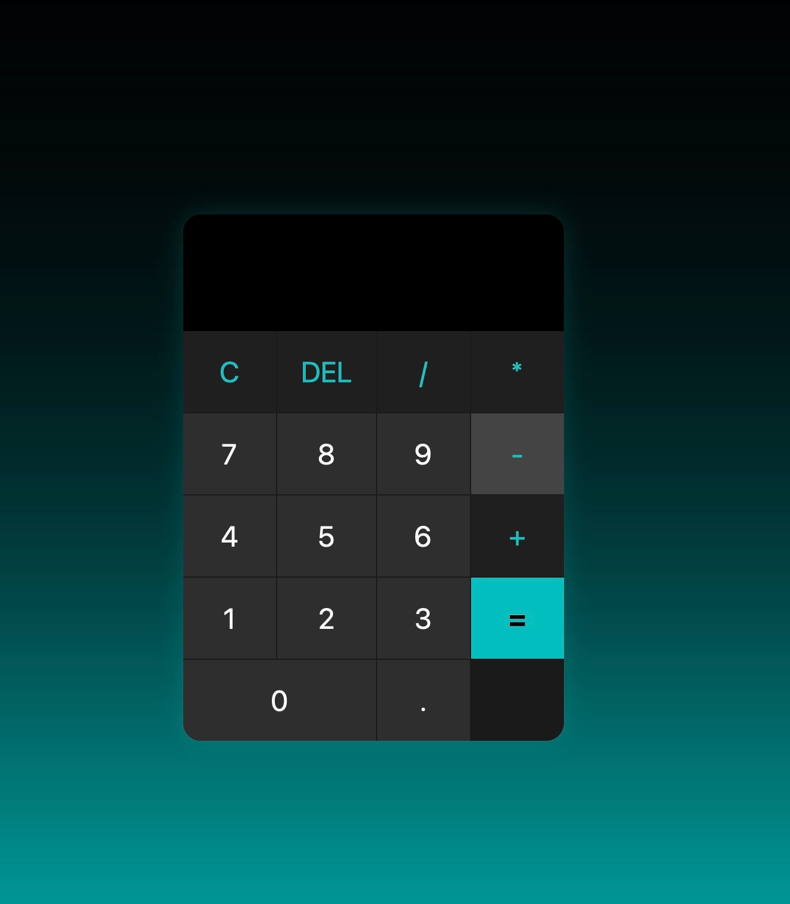

  

  
Desenvolvi uma calculadora interativa e responsiva que realiza operações matemáticas básicas e avançadas, oferecendo uma experiência fluida e intuitiva ao usuário.

  <a href="#tecnologias">🛠 Tecnologias</a>&nbsp;&nbsp;&nbsp;|&nbsp;&nbsp;&nbsp;
  <a href="#funcionalidades">👨🏾‍💻 Funcionalidades</a>&nbsp;&nbsp;&nbsp;|&nbsp;&nbsp;&nbsp;
  <a href="#deploy">🚀 Deploy</a>

## Sobre o projeto 

A **Calculadora Simples** é uma aplicação web que permite ao usuário realizar operações matemáticas de forma prática e simples.  
O design minimalista e responsivo garante fácil usabilidade tanto em computadores quanto em dispositivos móveis.  

Tudo isso em uma aplicação rápida, leve e adaptada para qualquer tela.

## Tecnologias  

Este projeto foi desenvolvido utilizando as seguintes tecnologias:

- HTML5 + CSS3  
- JavaScript  
- Git/GitHub

## Funcionalidades

- Cálculos em tempo real   
- Interface responsiva para mobile e desktop

## Licença

Este projeto está sob a licença MIT. Veja o arquivo [LICENSE](/LICENCE) para mais detalhes.

👨🏾‍💻 Desenvolvido por [Lucas Sousa](https://github.com/Lucas-Sousa-S)  

